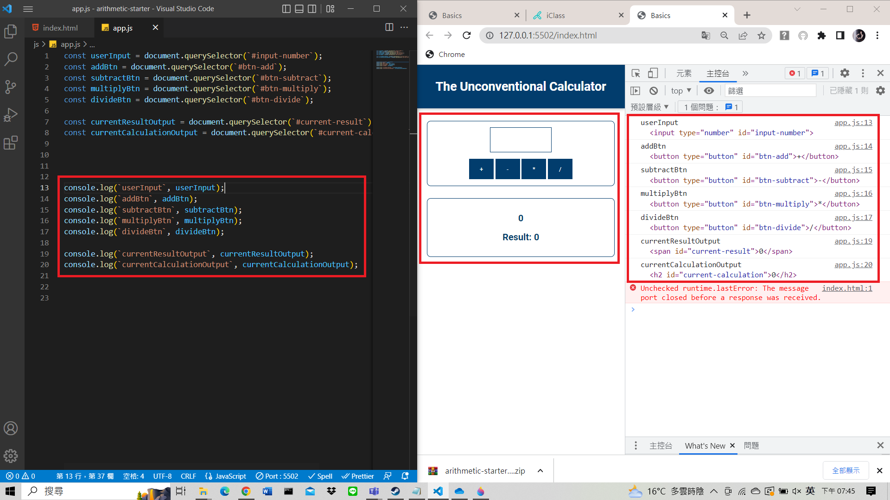
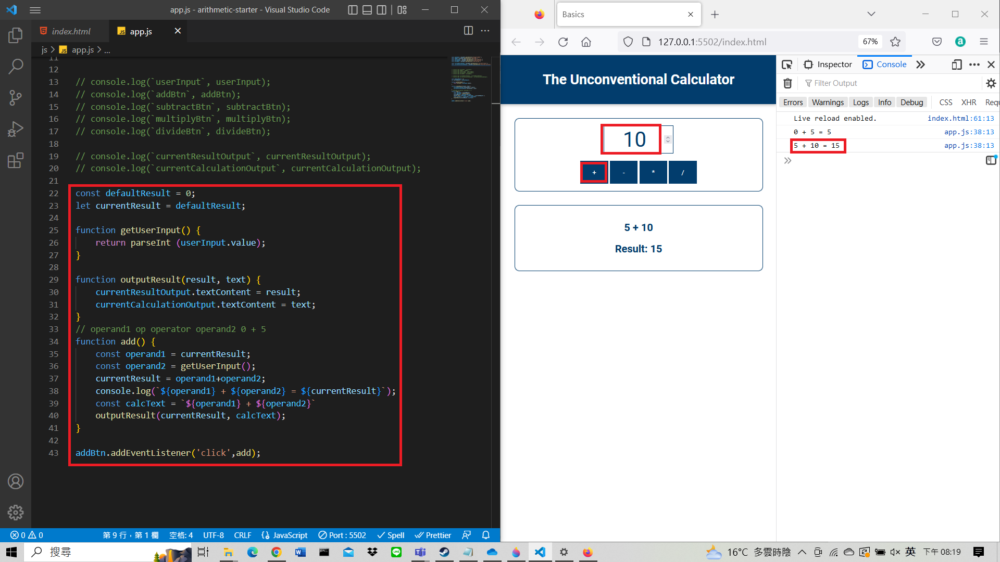
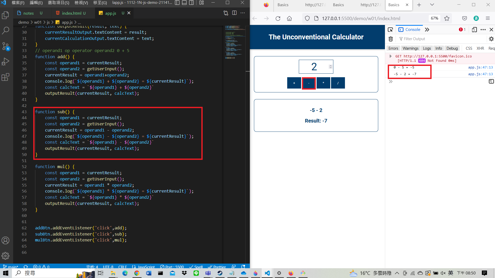
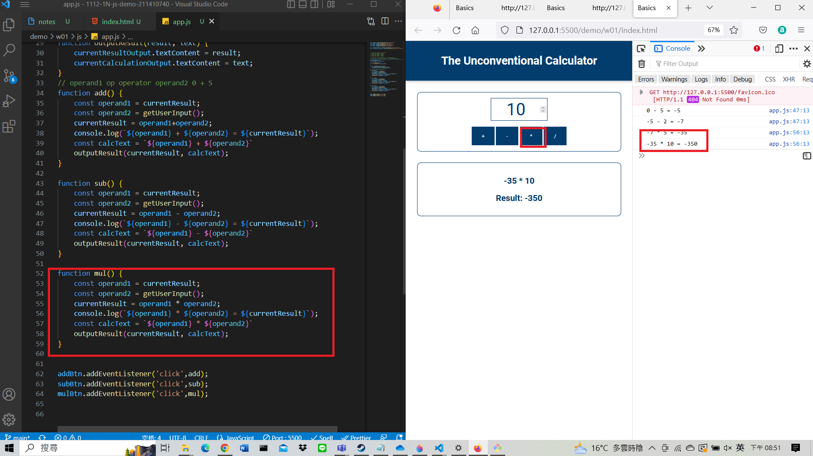
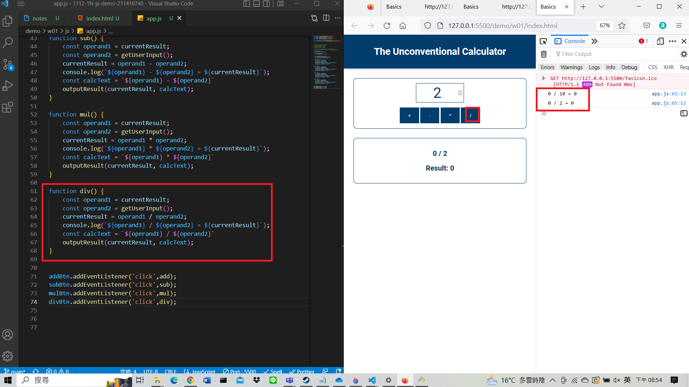
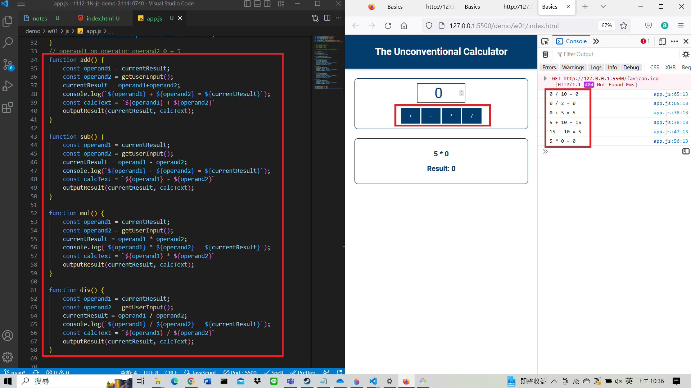

### W01-P1: 取得畫面輸入，4 個按鈕，兩個輸出，共 7 個，透過 console.log 印出

### W01-P2: 能做加法計算 operand1 + operand2

### W01-P3: 能做減法計算 operand1 - operand2

### W01-P4: 能做乘法計算 operand1 \* operand2

### W01-P5: 能做除法計算 operand1 / operand2

### W01-P6: 能做四則計算，加減乘除都要執行一遍，可任意順序，結果要正確

