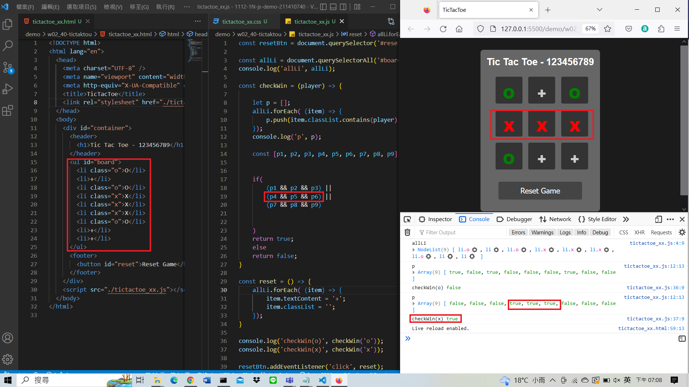
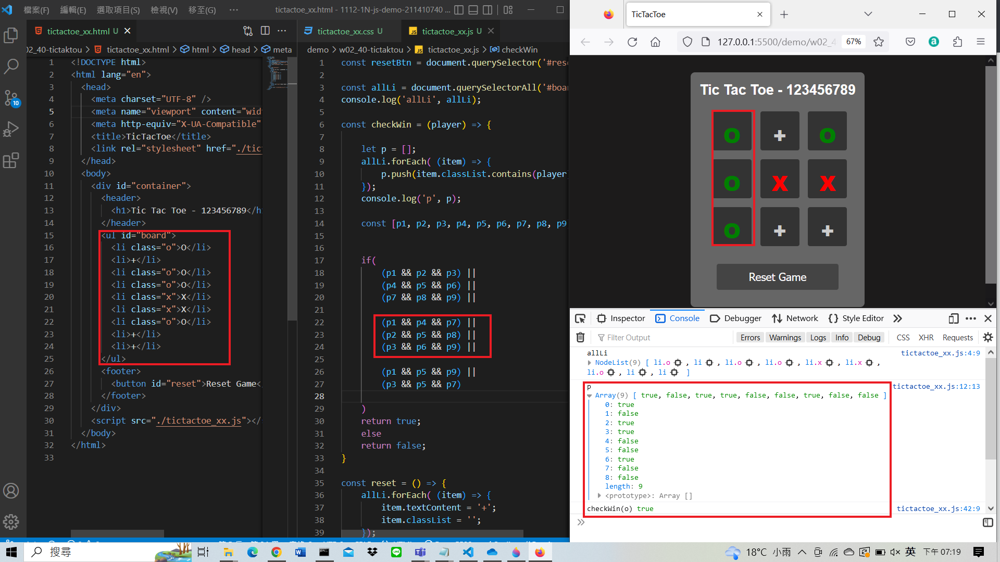
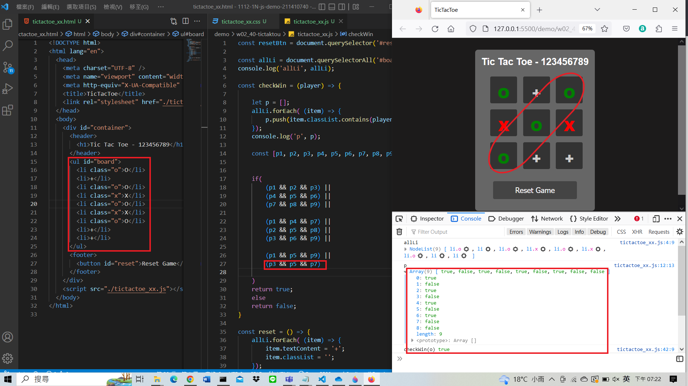
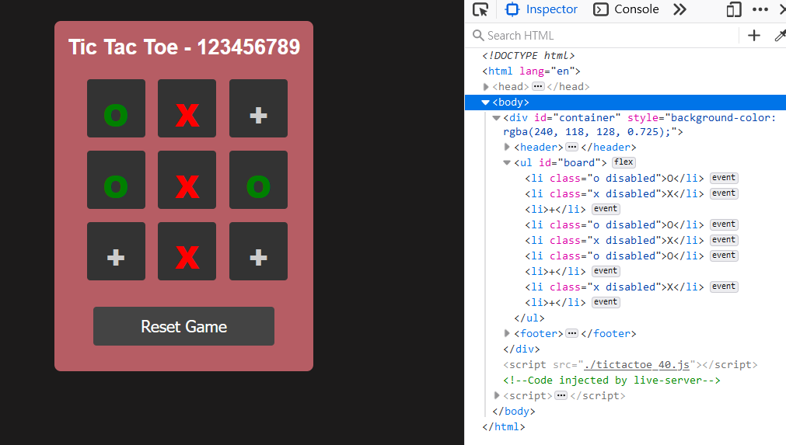
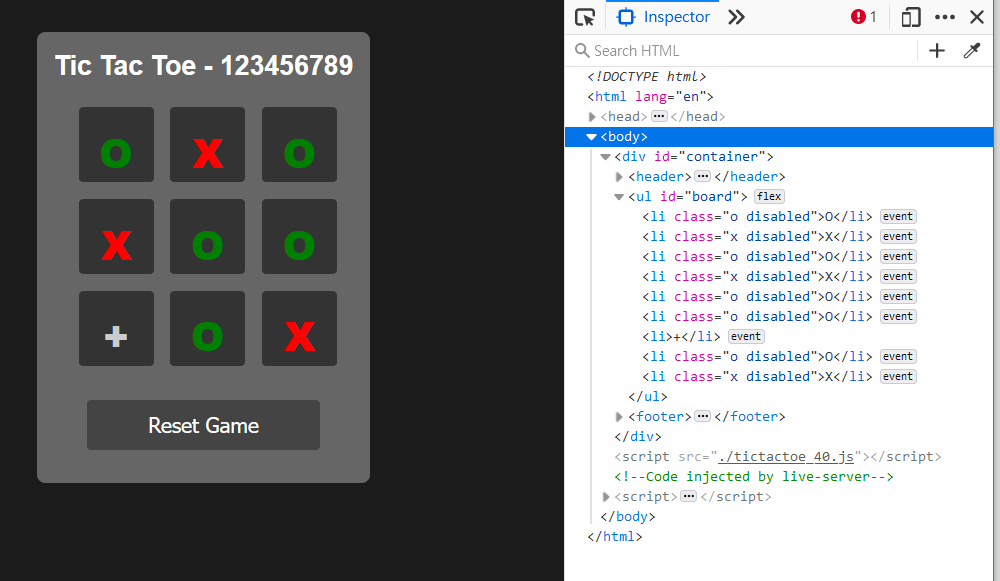
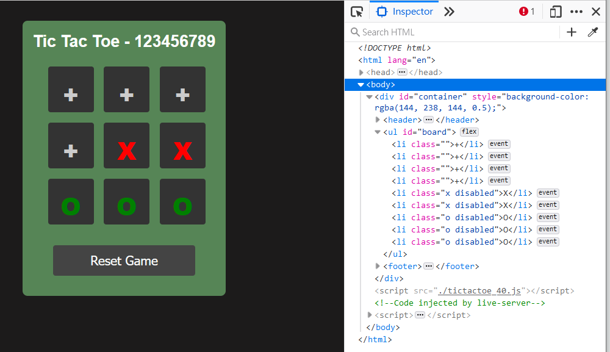
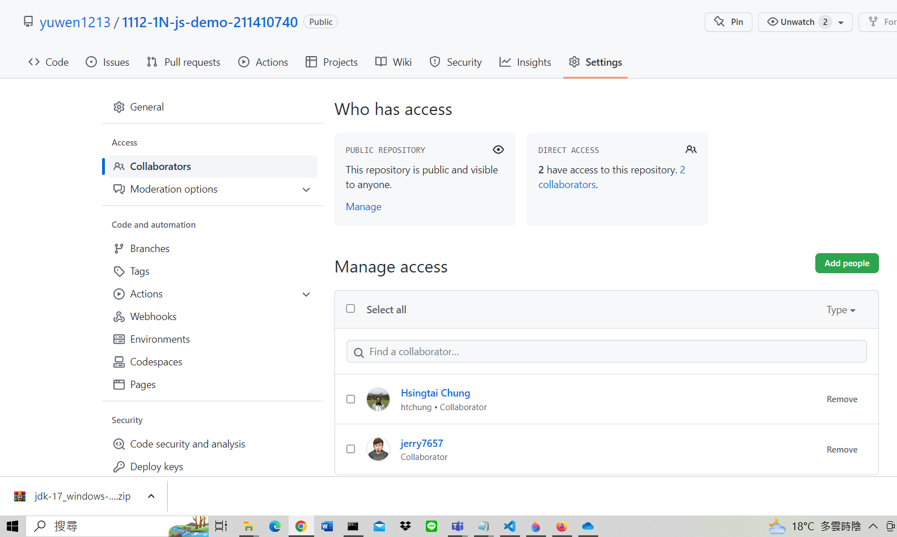

### W02-P1: checkWin to determine who wins, you need to create four images as said in class

### W02-P2: O win (9 times), X wins (8 times), tie (9 times)

### W02-P3: debug -- 已經走過的，不能走，但是 turn 加 1，下一步還是同一個 player

### W02-P4: debug -- 已經贏了，還可以繼續往下玩

### W02-P5: 邀請老師跟助教

